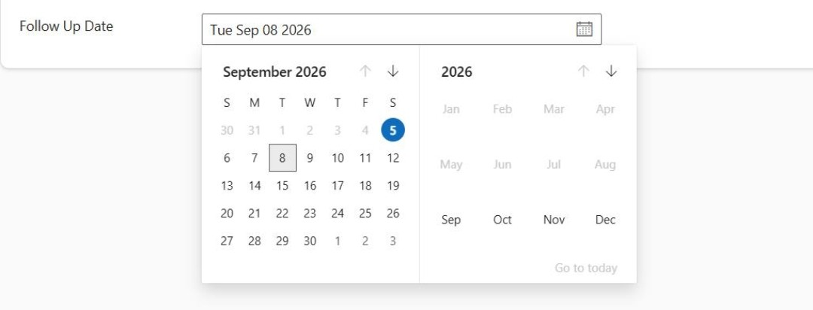
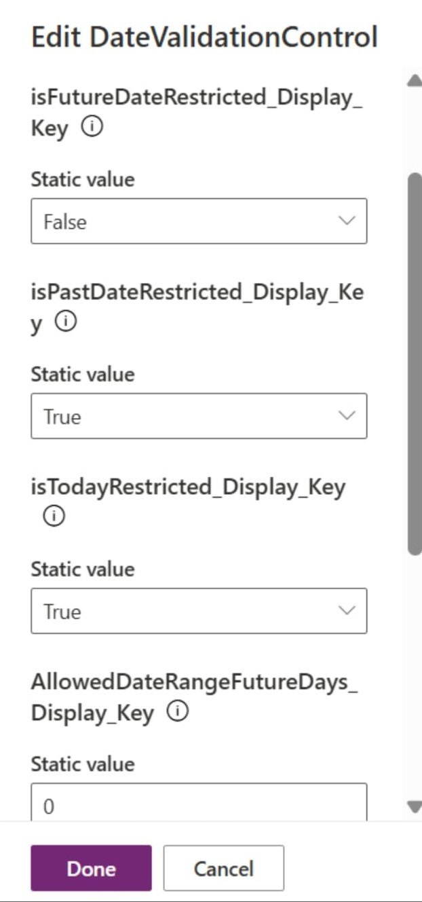
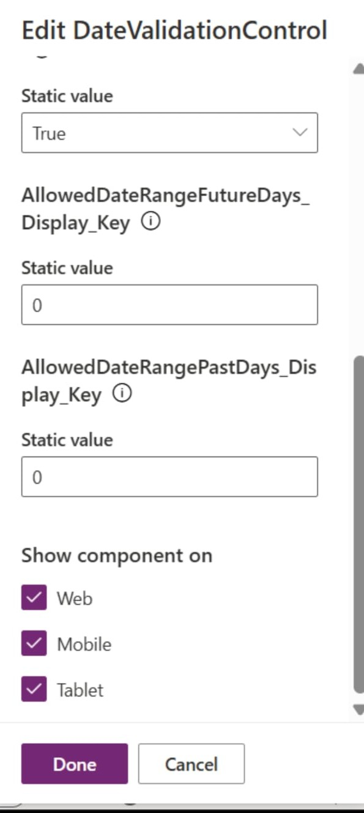

# Date Validation PCF Control

A Power Apps Component Framework (PCF) Date Validation control that provides a Fluent UI date picker with configurable date restrictions.

## Features

The control supports:

- Restricting dates before today
- Restricting dates after today
- Restricting today's date
- Allowing a configurable number of past days
- Allowing a configurable number of future days
- Binding the selected date back to the Power Apps/Dataverse field
- Fluent UI DatePicker interface

## Sample Control

The Date Validation control appears as a date picker in the application.



## Configuration

The control exposes the following configurable properties.

| Property | Type | Description |
|---|---|---|
| `date` | DateOnly | Bound date value |
| `isFutureDateRestricted` | Two Options | Restricts dates after today |
| `isPastDateRestricted` | Two Options | Restricts dates before today |
| `isTodayRestricted` | Two Options | Restricts today's date |
| `AllowedDateRangeFutureDays` | Whole Number | Number of future days allowed |
| `AllowedDateRangePastDays` | Whole Number | Number of past days allowed |

### Configuration example

The following screenshots show the control configuration in Power Apps.





## Date Restriction Logic

### Past Date Restriction

When `isPastDateRestricted` is set to `True`, the minimum selectable date is today.

### Future Date Restriction

When `isFutureDateRestricted` is set to `True`, the maximum selectable date is today.

### Today Restriction

When `isTodayRestricted` is set to `True`, today's date is added to the restricted dates list.

### Past Date Range

For example:

```text
AllowedDateRangePastDays = 30
```

allows dates within the configured past-day range, subject to the other restrictions.

### Future Date Range

For example:

```text
AllowedDateRangeFutureDays = 30
```

allows dates within the configured future-day range, subject to the other restrictions.

## Project Structure

```text
DateValidationControl/
│
├── Components/
│   └── DatePickerControl.tsx
│
├── generated/
│   └── ManifestTypes.d.ts
│
├── images/
│   ├── date-control.png
│   ├── configuration-1.png
│   └── configuration-2.png
│
├── ControlManifest.Input.xml
├── index.ts
├── DateValidationControl.pcfproj
├── package.json
├── pcfconfig.json
├── tsconfig.json
├── setup.bat
└── README.md
```

## Technologies

- TypeScript
- React
- React DOM
- Microsoft Power Platform Component Framework (PCF)
- Fluent UI React

## Sample Implementation

The main implementation is contained in:

```text
index.ts
Components/DatePickerControl.tsx
ControlManifest.Input.xml
```

The `index.ts` file integrates the React DatePicker component with the PCF lifecycle and passes the manifest configuration values to the DatePicker component.

The `DatePickerControl.tsx` file contains the date restriction logic and Fluent UI DatePicker.

## Author

Harshavardan

## License

Add the appropriate license for your project before distributing this repository.
